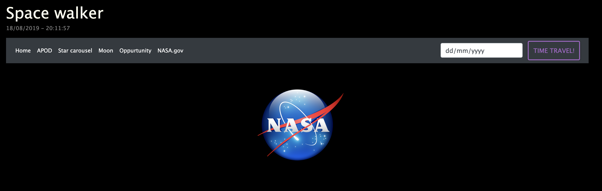

# Space walker - NASA / Google Maps API project
Проект для любителей космоса, иcпользующий API NASA и Google Maps.

<b><h3>About:</h3>

</b>
</img>

<b><h3>Get started:</h3>

</b>
<code>
npm install;
npm start
</code>

<b><h3>MVP:</h3>

</b>

<ul>
  <li>Просмотр Astronomy picture of the day (APOD), в том числе HD версии</li>
  <li>Time travel - фото дня от NASA за любой день, начиная с 1996 года</li>
  <li>Star carousel - simple image carousel, lib test</li>
  <li>Moon - карта Луны (нужен валидный ключ Google API, подставить вместо 'mapsApi' в map.hbs)</li>
</ul>

<b><h3>Author:</h3>

</b>

<ul>
  <li><a href="https://github.com/xanderoku">Александр Окунев</li>
</ul>

<b><h3>Technologies:</h3>

</b>

Node.js, Express.js, Handlebars, MongoDB, Mongoose, NASA API, Google Maps API
